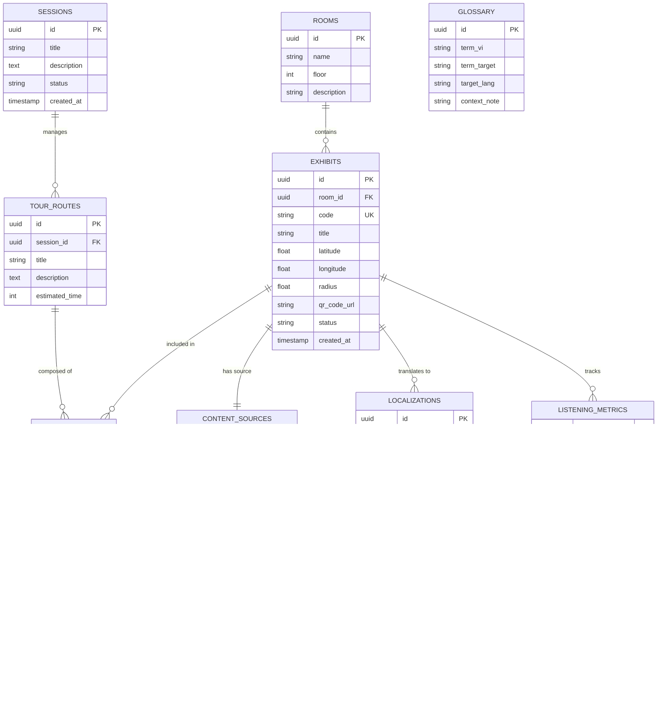

# Sơ đồ thực thể ERD

```mermaid
erDiagram
SESSIONS ||--o{ TOUR_ROUTES : "manages"
TOUR_ROUTES ||--o{ TOUR_EXHIBITS : "composed of"
EXHIBITS ||--o{ TOUR_EXHIBITS : "included in"
ROOMS ||--o{ EXHIBITS : "contains"
EXHIBITS ||--|| CONTENT_SOURCES : "has source"
EXHIBITS ||--o{ LOCALIZATIONS : "translates to"
LOCALIZATIONS ||--o{ AUDIO_MEDIA : "generates"
EXHIBITS ||--o{ LISTENING_METRICS : "tracks"

    SESSIONS {
        uuid id PK
        string title
        text description
        string status
        timestamp created_at
    }

    TOUR_ROUTES {
        uuid id PK
        uuid session_id FK
        string title
        text description
        int estimated_time
    }

    TOUR_EXHIBITS {
        uuid id PK
        uuid tour_id FK
        uuid exhibit_id FK
        int step_order
    }

    ROOMS {
        uuid id PK
        string name
        int floor
        string description
    }

    EXHIBITS {
        uuid id PK
        uuid room_id FK
        string code UK
        string title
        float latitude
        float longitude
        float radius
        string qr_code_url
        string status
        timestamp created_at
    }

    CONTENT_SOURCES {
        uuid id PK
        uuid exhibit_id FK, UK
        text original_text
        string original_audio_url
        string source_language
    }

    LOCALIZATIONS {
        uuid id PK
        uuid exhibit_id FK
        string language_code
        text translated_text
        jsonb timestamps
        boolean is_reviewed
        timestamp updated_at
    }

    AUDIO_MEDIA {
        uuid id PK
        uuid localization_id FK
        string file_url
        int duration_seconds
        int bitrate
        string storage_path
    }

    LISTENING_METRICS {
        uuid id PK
        uuid exhibit_id FK
        string language_code
        int duration_listened
        string trigger_type
        timestamp recorded_at
    }

    GLOSSARY {
        uuid id PK
        string term_vi
        string term_target
        string target_lang
        string context_note
    }
```
